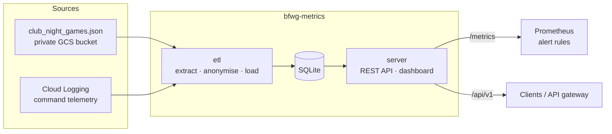

# bfwg-metrics

A Go service that publishes aggregate usage and results metrics for the
[Blind Faith Wargaming](https://github.com/blindfaithwargaming) Discord bot, a
community bot for a wargaming club in Cardiff.

The project is an integration exercise. It extracts data from two systems the bot already writes to (a JSON state file and Cloud Logging), transforms and anonymises it, loads it into SQL, and exposes it through a documented REST API, an HTML dashboard and Prometheus metrics. It runs locally, in Docker Compose or on Kubernetes.



## What it demonstrates

| Area | Where |
|---|---|
| **Go**: stdlib `net/http` routing, `log/slog`, `embed`, graceful shutdown | [`cmd/server`](cmd/server), [`internal/api`](internal/api) |
| **ETL**: idempotent loads, snapshot vs append strategies, audit table | [`internal/etl`](internal/etl), [`etl_runs`](internal/store/migrations/001_initial.sql) |
| **SQL**: versioned migrations, window functions (p95 latency), constraints | [`internal/store`](internal/store) |
| **API design**: OpenAPI 3 contract served by the API itself | [`api/openapi.yaml`](api/openapi.yaml) |
| **Monitoring**: RED metrics, ETL health gauges, alert rules, runbook | [`internal/api/metrics.go`](internal/api/metrics.go), [`deploy/prometheus`](deploy/prometheus), [`docs/runbook.md`](docs/runbook.md) |
| **Docker**: multi-stage build, distroless non-root image | [`Dockerfile`](Dockerfile), [`docker-compose.yml`](docker-compose.yml) |
| **Kubernetes**: Deployment, CronJob, PVC, probes, hardened security context, kustomize | [`deploy/k8s`](deploy/k8s) |
| **Data protection**: member identifiers dropped at extract and enforced by tests | [ADR 0002](docs/adr/0002-member-data-privacy.md) |
| **CI**: gofmt, vet, race-enabled tests, manifest render, image build | [`.github/workflows/ci.yml`](.github/workflows/ci.yml) |

## Quick start

Requires Go 1.27+. Everything runs against the synthetic fixtures in [`testdata/`](testdata).

```bash
make test          # go test -race ./...
make run           # load sample data, then serve on :8080
```

Then open http://localhost:8080. Other endpoints:

| Path | Purpose |
|---|---|
| `/api/v1/commands/usage?days=30` | Per-command volume, success rate, avg and p95 latency |
| `/api/v1/games/summary` | Games per system; faction win/loss/draw records |
| `/api/v1/etl/runs` | Latest ETL run per source (audit trail) |
| `/api/openapi.yaml` | API contract |
| `/metrics` | Prometheus exposition |
| `/healthz`, `/readyz` | Liveness and readiness probes |

### Docker Compose

```bash
make up            # etl → server on :8080, Prometheus on :9090
make down
```

### Kubernetes (kind)

```bash
make kind-up       # create a local cluster
make kind-deploy   # build, load image, apply manifests, run the ETL once
kubectl -n bfwg-metrics port-forward svc/bfwg-metrics 8080:80
```

## Loading real data

Real bot data is member data. It stays out of this repository (`/private/` is
git-ignored) and is only processed locally by someone with access to the
club's private state bucket:

```bash
mkdir -p private
gcloud storage cp gs://<state-bucket>/club_night_games.json private/
gcloud logging read 'jsonPayload.message=~" done guild="' \
  --freshness=30d --format=json > private/command_logs.json
go run ./cmd/etl -games private/club_night_games.json -command-logs private/command_logs.json
```

## Configuration

| Variable | Default | Used by |
|---|---|---|
| `BFWG_DB_PATH` | `bfwg-metrics.db` | server, etl |
| `BFWG_ADDR` | `:8080` | server |
| `BFWG_MIN_FACTION_GAMES` | `3` | server: factions with fewer games are withheld |
| `BFWG_GAMES_PATH` | (none) | etl, same as `-games` |
| `BFWG_COMMAND_LOGS_PATH` | (none) | etl, same as `-command-logs` |

## Documentation

- [Architecture](docs/architecture.md)
- [Runbook](docs/runbook.md): service levels, alerts, incident steps
- [Roadmap](docs/roadmap.md)
- Decisions: [0001 SQLite storage](docs/adr/0001-sqlite-storage.md) · [0002 Member data privacy](docs/adr/0002-member-data-privacy.md)
